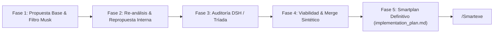

# /Smartplan — Planeación Inteligente Dialéctica (5 Fases)

Produce un plan de implementación técnico, blindado y validado empíricamente por la Tríada.
Esto **NO es ejecutar código** — es estructurar el plan detallado que después ejecutará `/Smartexe`.

---

## 🔄 El Ciclo Dialéctico Obligatorio de 5 Fases

### **Fase 1: Propuesta Base & Filtro de Musk (Look Outside & Tool Inventory)**
1. **Filtro de Musk & Anti-Sesgo de Túnel:**
   - ¿Por qué existe este requerimiento? ¿Puede eliminarse o simplificarse antes de codificar?
   - Búsqueda web / estado del arte / librerías canónicas. Cero reinvención de la rueda.
2. **Auditoría de Herramientas Existentes (Zero-Waste Check):**
   - Evaluar inventario (`KEYS.md`, `PROJECTS_MAP.md`, Vault `:9000`, 9router, etc.).
3. **Anclaje en Código Real:**
   - Validar cada archivo, ruta y función con lecturas quirúrgicas (`view_file`, `grep_search`). Cero suposiciones.

### **Fase 2: Re-análisis Crítico & Repropuesta Interna (Self-Critique)**
1. **Detección de Puntos Ciegos:** Identificar posibles fallas silenciosas, sobre-ingeniería, cuellos de botella de latencia y condiciones de carrera.
2. **Contra-Propuesta Dialéctica:** Formular activamente una arquitectura alternativa más simple, económica en tokens y rápida.
3. **Timebox Anti-Parálisis:** Máximo 1-2 iteraciones de auto-crítica para evitar parálisis por análisis.

### **Fase 3: Co-Auditoría & Sugerencias de DSH / Tríada (Cross-Model Review)**
1. **Consulta Externa Obligatoria:** Someter la propuesta y contra-propuesta al dictamen cruzado de las mentes del stack:
   - **DSH / RITA (DeepSeek / Mistral en Vibe):** Deuda técnica, anti-patterns, cobertura TDD y ergonomía del harness.
   - **Karen (Hermes en KVM4 :8642):** Resiliencia de infra, concurrencia, SQLite WAL locks, sockets y fallas en runtime.
2. **Extracción de Heads-Up:** Advertencias operativas concretas y riesgos latentes no evidentes.

### **Fase 4: Validación de Viabilidad & Fusión Sintética de Ideas (Feasibility Gate & Synthesis Merge)**
1. **Filtro de Viabilidad:**
   - Descartar alucinaciones, endpoints inexistentes y complejidad innecesaria.
   - Validar compatibilidad cruzada (POSIX/Windows, permisos, dependencias).
2. **Fusión Sintética:** Integrar las mejores ideas de la propuesta base, la contra-propuesta interna y la auditoría externa en una arquitectura unificada y superior.

### **Fase 5: Emisión del Smartplan Definitivo (`implementation_plan.md`)**
1. **Estructura TDD (Red -> Green -> Refactor):**
   - Define primero la prueba de verificación objetiva y luego el bloque de implementación.
2. **Cero Placeholders:** Nada de `// TODO` o soluciones a medias. Código concreto y comandos exactos.
3. **Higiene Operativa & Ciclo de Vida:** Bloques `try/finally`, liberación de sockets/puertos/VRAM y rollback automático en caso de fallo.
4. **Artefacto `implementation_plan.md`:** Generar o actualizar el documento listo para ejecución inmediata con `/Smartexe`.
